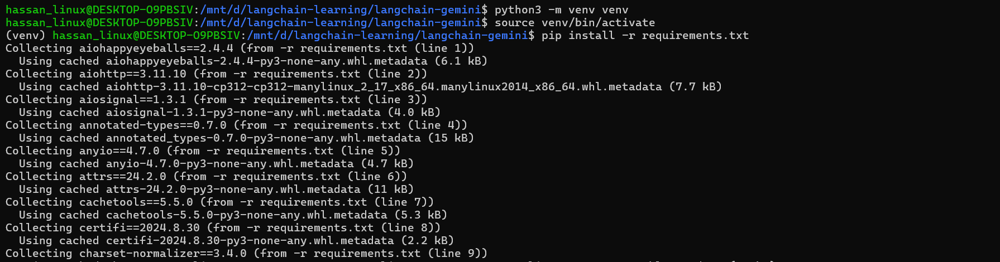
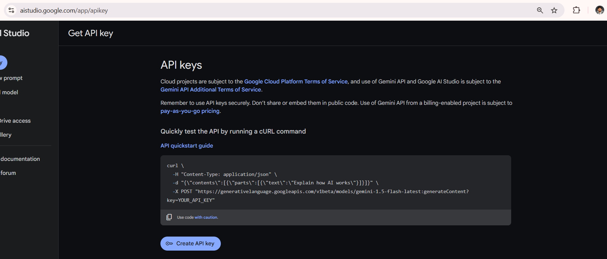
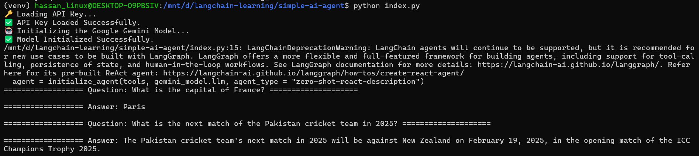

# AI Agent with LangChain, Google Gemini, and DuckDuckGo

This repository demonstrates how to create an AI Agent using [LangChain](https://github.com/hwchase17/langchain) with [Google Gemini](https://ai.google/) and [DuckDuckGo](https://duckduckgo.com/) to build AI-powered applications using multimodal capabilities. It's designed as a starting point for developers looking to explore and experiment with LangChain AI Agents.

## 🚀 Features
- **Beginner-friendly**: Simple setup to get started quickly.
- **Modular Architecture:** Uses LangChain to chain together prompts, tools, and reasoning steps.
- **LLM Integration:** Powered by Google Gemini for advanced reasoning and natural language capabilities.
- **Search Integration:** Employs DuckDuckGo as a tool, allowing the agent to query the web, retrieve information, and enhance its knowledge of current events or data outside the training corpus.
- **Extensible:** Easily adapt the agent to incorporate new tools, models, or additional data sources.

---

## 🛠️ Setup Instructions

Follow these steps to set up and run the project on your local machine:

### 1. Clone the Repository
```bash
git clone https://github.com/hmshb/langchain-ai-agent-google-gemini.git
cd langchain-ai-agent-google-gemini
```

### 2. Create a Virtual Environment
```bash
python -m venv venv
source venv/bin/activate  # For Linux/Mac

.\venv\Scripts\activate # For Windows
```

### 3. Install Dependencies
```bash
pip install -r requirements.txt
```



### 4. Generate a Google API Key
1. Visit Google AI Studio.
2. Create an API key for accessing Google Gemini.
3. Copy the generated API key.



### 5. Update ```.env``` File
 - Add the following line to the .env file, replacing your_google_api_key with your actual API key:
    ```
    GEMINI_API_KEY=your_google_api_key
    ```
   
### 6. Run the project
```bash
python index.py
```



---

## 📂 Project Structure
```
langchain-ai-agent-google-gemini/
├── .env                 # API key configuration file
├── gemini.py            # Gemini AI LLM Model configurations
├── index.py             # Actual script with whole feature
├── requirements.txt     # Optional: Use for dependencies
├── README.md            # Documentation file
├── venv/                # Virtual environment
```

---

## 🛠️ Troubleshooting & FAQ

- **Gemini Authentication Errors:** Ensure GEMINI_API_KEY is correctly set. If you face issues, verify your key’s validity and permissions.
- **No Search Results:** DuckDuckGo might return minimal results if the query is very niche. Consider adjusting the query or checking network connectivity.
- **Rate Limits:** If you frequently hit rate limits on the LLM side, consider strategies like caching results, batching requests, or upgrading your plan.

---

## ⭐ Acknowledgments

Special thanks to:

- **[LangChain](https://github.com/hwchase17/langchain)** for providing a robust framework for building LLM applications.
- **[Google Gemini](https://ai.google/)** for their powerful multimodal AI capabilities.
- **[DuckDuckGo](https://duckduckgo.com/)** for allowing the agent to query the web.

---

## 📜 License

This project is open-source and licensed under the [MIT License](LICENSE).

---

## 📢 Get Involved!

If you find this repository helpful, please consider:

- ⭐ **Starring the Repository** to show your support.
- 📤 **Forking the Repository** to explore further and make your own customizations.
- 💬 **Sharing Your Feedback** by opening issues or discussions.

---

## 📝 Notes

**Google Gemini**, **Langchain** and **DuckDuckGo** is currently in limited or preview release (depending on your region and timing), and integration details may change as the service evolves. Always refer to official documentation for the most up-to-date guidance.

### Let's build amazing AI-powered applications together!